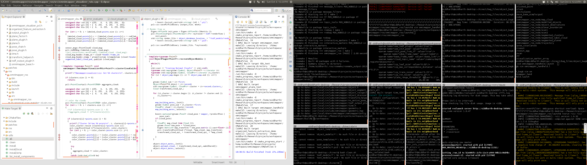

I am writing down the list of softwares that I use everyday. This is for my own backup and for anyone who 
is interested in knowing about it. 

1. Eclipse IDE: I have been using Eclipse for the last one year. Before that I used to code completely in VIM but recently I have started to like Eclipse due to its capability to handle large projects smoothly.

2. <a href="http://gnometerminator.blogspot.com/p/introduction.html">Terminator</a>: For all the other purposes like running roscore, rviz, bag files, launching code et al., I use terminator. 

</img> 

